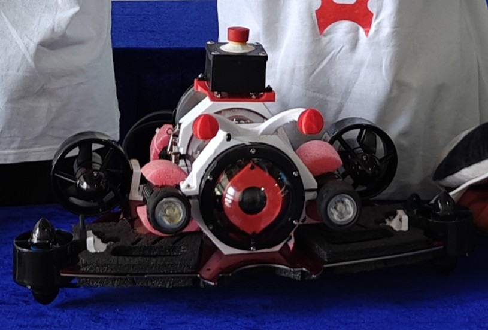
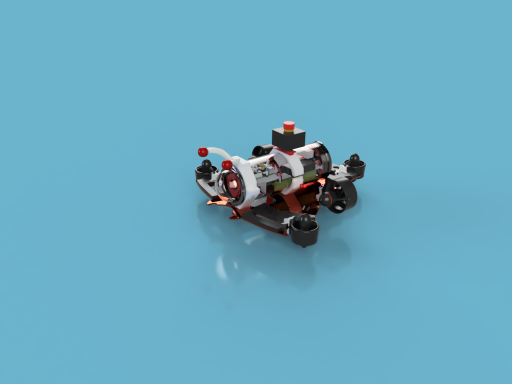
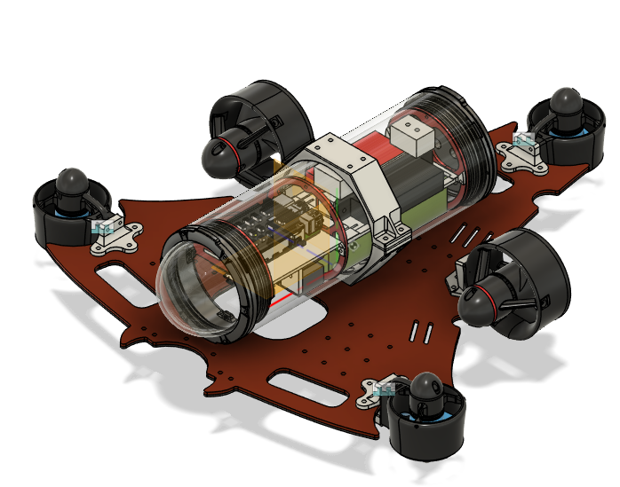
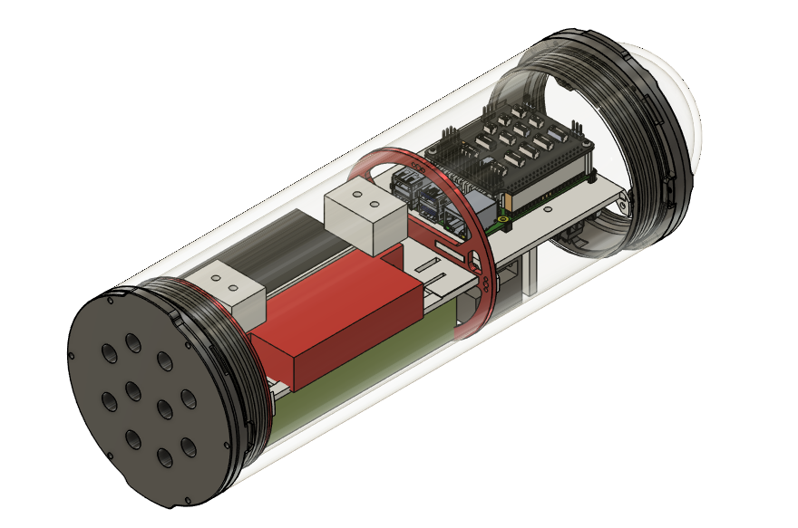
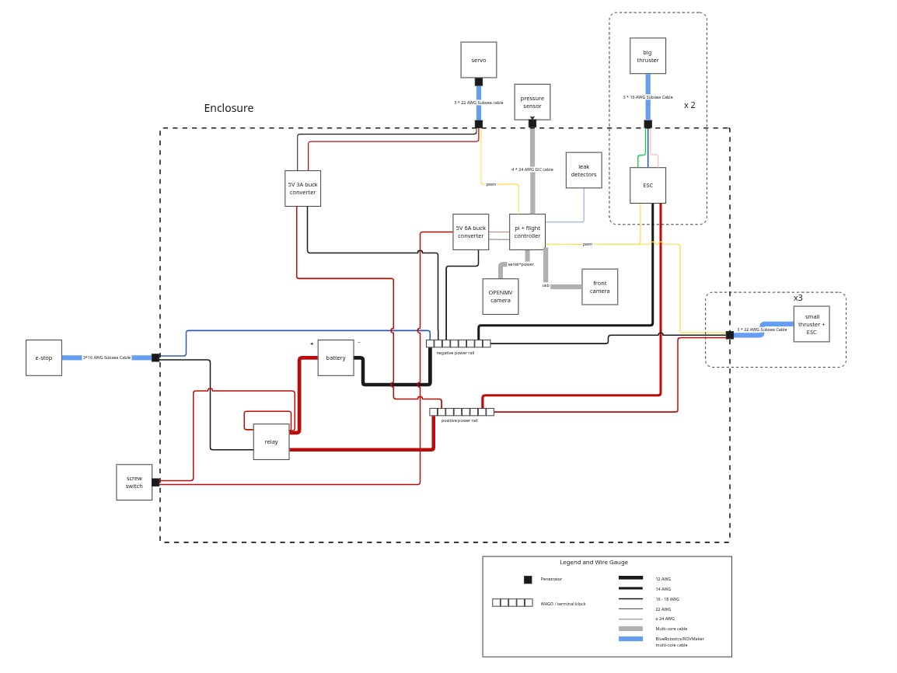
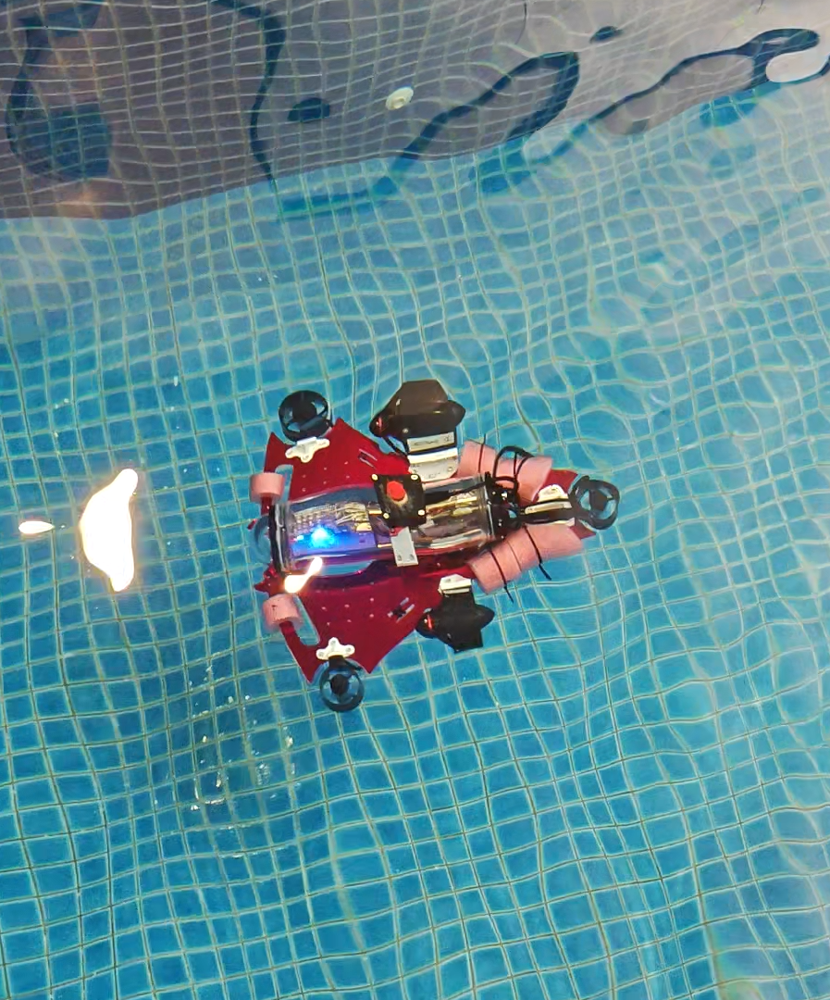

# OpenMantaClaus



OpenMantaClaus is designed to be the cheapest open-source AUV out there — specifically built when competing in SAUVC 2026 on an incredibly limited budget. The hardware stack uses a 5-thruster configuration to serve as an accessible, low-cost entry into autonomous underwater robotics. The software stack combines mission orchestration, monocular perception, bearing-only EKF SLAM, and task execution, with integrated YOLO datasets and models for robust visual tracking.

## Purpose

The robot is designed to execute the competition mission pipeline end to end: the `brain` node selects the mission sequence, `cv` detects visual targets, `ekfslam` filters and associates observations, and `tasks` converts those observations into RC override commands.

## Mechanical Design

- 5-thruster configuration.
- Two forward-facing thrusters for planar motion.
- Three upward-facing thrusters for vertical control.
- Control is treated like a differential-drive-style planar system for mission logic.
- A monocular camera provides the primary visual feed.



## YOLO Resources

- **CV Perception Stack:** The computer vision system runs a quantized YOLO26n TFLite model on the companion computer (Raspberry Pi 4B) to detect objects under 10–12 Hz constraints.
- **Detection Classes:** Targets include `flag`, `gate`, `flare`, `bucket`, and ArUco markers.
- **Kaggle Dataset:** The raw camera images, labeled annotation sets, and training preprocessing configurations are hosted on Kaggle. The repository also includes example code on how to train the models.
  - **[Kaggle Dataset Page](https://www.kaggle.com/datasets/kushagrajaveri/mantaclaus-sauvc-2026-yolo-dataset/data)**
- **YOLO Development Repository:** The repository containing the scripts used for data processing and model training can be found at **[SAUVC_yolo](https://github.com/kushagra77/SAUVC_yolo)** (Note: This repository is for reference only, is not actively maintained, and is not structured for clean viewing).
- **Model Storage:** Training runs and exported model weights/artifacts are stored under `scripts/yolo/runs/detect/`.

<video src="docs/assets/yolo_recording.mp4" autoplay loop muted playsinline width="100%"></video>

## Bill of Materials

The detailed hardware Bill of Materials with sourcing links, quantities, and estimated costs is available in [BOM.md](BOM.md).

> [!NOTE]
> Working with the hardware wiring harness requires experience with and access to crimping tools and standard connectors (like Dupont and RCY connectors), which is strongly recommended for this build.

* **Propulsion:** 5 thrusters (2 planar differential-drive-style, 3 vertical-pitch-roll), ESCs, and associated mounting hardware.
* **Companion Compute:** Raspberry Pi 4B (8GB RAM).
* **Flight Controller:** Pixhawk/ArduSub flight controller connected via MAVROS bridge.
* **Perception:** Monocular camera device connected via USB.
* **Structure:** Watertight companion compute enclosure, battery enclosure, and custom aluminum/acrylic frame.




## CAD & Assembly

The CAD models are hosted on GrabCAD.
**[GrabCAD Library Page](https://grabcad.com/library/mantaclaus-auv-1)** (CAD files)

> [!NOTE]
> Detailed assembly instructions are currently in progress and will be developed if there is interest from the community in building this specific chassis.

## MantaClaus Wiring Diagram

The complete electrical and electronic wiring schematic for the entire robot, including the companion computer (Raspberry Pi 4B), flight controller, thruster ESCs, power distribution, and the relay-controlled emergency stop (E-Stop) loop.


> [!IMPORTANT]
> Some experience with and access to crimping tools and standard connectors (like Dupont and RCY connectors) is strongly recommended for assembling the electronics tray and wiring loop correctly and safely.

## SAUVC 2026 Competition Trial & Hardware Specs

### Physical Robot Experiences (2nd Place Finish)
OpenMantaClaus is a budget-focused solo build that successfully competed in **SAUVC 2026** and secured **2nd Place**.
* **Pre-qualification Video:** [SAUVC 2026 Pre-qualification Video](https://youtu.be/PHm0sGHbVYI)

Despite entering the competition without full-pool integration testing, the bearing-only EKF SLAM coupled with simple odometry and IMU updates performed exceptionally well:
* **Gate Task:** Cleared the gate reliably in both forward and reverse modes.
* **Flares Task:** Sequenced and approached each flare closely, though narrowly missed contact due to final parameter tuning limits.
* **Buckets Task:** Aligned perfectly with the target buckets, but dropped the ball exactly off-by-one bucket due to course-spacing tuning offsets.

### Key Technical Challenges & Lessons Learned
1. **Simulation vs. Full Pool Tuning:** Individual nodes functioned consistently in local dry tests, but the full integrated sequence required on-site pool tuning that was restricted by limited testing runs.
2. **Simplified Odometry Limitations:** The trialled thruster dynamics model is highly sensitive to external variables (e.g., battery voltage decline, water turbidity). 
   * *Recommendation:* Integrating visual inertial odometry (VIO) running on an onboard low-power camera (e.g. OpenMV bottom-facing camera) or a DVL would resolve drift.
3. **Camera Field of View:** The sparse pool environment has limited landmarks. A wider-angle camera lens would keep features in view longer, allowing continuous EKF correction.

### Companion Compute Constraints
* Runs on a **Raspberry Pi 4B (8GB)**.
* **Compute Bottleneck:** Running the TFLite quantized YOLO model consumes significant CPU, capping inference rates at **10–12 Hz**. 
* **Control Frequencies:** The task control loop runs at **20 Hz** and EKF SLAM runs at **25 Hz** (both lightweight on CPU).
* **Speed Bounds:** For timing safety, the default robot speed scale is locked at **0.3** (60% capacity). Commanding speeds above **0.5** resulted in processing latency and delayed controller response.

## Getting Started

While reading the [full architecture documentation](docs/architecture.md) is recommended to gain a deep understanding of the system, you can follow this quick-start guide to get the robot up and running.

### 1. Build and Assemble the Robot
Follow the [Bill of Materials (BOM.md)](BOM.md) and use the CAD files in [CAD & Assembly](#cad--assembly) to construct the robot. Ensure all wiring matches the [Wiring Diagram](#mantaclaus-wiring-diagram).

### 2. Configure BlueOS
1. Access the companion computer and get familiarized with the [BlueOS interface](https://blueos.bluerobotics.com/).
2. **Important:** Ensure you are running **BlueOS version > 4.7** so the Bar02 pressure sensor works out of the box.
3. Connect BlueOS to a reliable Wi-Fi hotspot for seamless development and telemetry.

### 3. Set Up VS Code Development Environment
Install the **Blueos ROS 2 extension (`ros2-manta`)** and open VS Code inside the dockerized container provided by the extension. This mounts the workspace and gives you direct access to the built-in development environment. You should be able to clone this repository within the shared persistent workspace by adding your GitHub SSH key to the shared `.ssh` folder for easier access.

For reference on how the Docker image is built, see the [blueos-ros2 (ros2-humble branch) repository](https://github.com/kushagra77/blueos-ros2/tree/ros2-humble). It is a custom fork of the original [blueos-ros2 repository](https://github.com/itskalvik/blueos-ros2) specifically tailored for this project.

### 4. Sensor Calibration & Pre-flight Checks
- **Sensor Calibration:** Calibrate all sensors (IMU, pressure, etc.) via the BlueOS dashboard.
- **Compass:** If you experience magnetic interference (highly common in indoor pool environments), it is recommended to **disable the compass** and rely on gyro-based heading/odometry.
- **Frame Configuration:** Ensure BlueOS is configured to use the **BLUEROV1** frame.

### 5. Verify Propulsion and Direct Control
1. Put the robot in the pool.
2. Run the scripts in the [mavros_control](src/mavros_control) package to verify basic movement.
3. **Caution:** Verify the thruster directions. If the robot moves erratically, you may need to reverse specific thrusters in your flight controller configuration. 
   
> [!IMPORTANT]
> Thruster and direction verification is a crucial step. If you get stuck, feel free to ask the author, raise a GitHub issue, or ask on public AUV/ArduSub forums.

### 6. Create or Tune your Odometry Node (Crucial)
> [!WARNING]
> Users are strongly urged to create their own odometry node (and modify the launch files in `manta_bringup` to launch their custom node instead of the default `odometry_node`). The default odometry node is specifically designed for differential-drive thrusters, relies on a fragile `/mavros/rc/out` topic that is highly dependent on specific channel wiring and hardware, and is tuned specifically for the original OpenMantaClaus AUV build.
>
> To create your own custom odometry node (e.g., using bottom-camera VIO, DVL, or custom kinetics), you simply need to build a ROS 2 node that publishes the `odom -> base_link` transform on TF at a high frequency (ideally > 50 Hz). Point the bringup launch files to your node, and `ekfslam_node` will automatically read `odom -> base_link` to compute SLAM map updates and publish `map -> odom`.

If you choose to use or adapt the default model-based odometry:
* **Standard Build (BLUEROV1 Frame):** Adjust physical scaling constants `thrust_k_f` (forward thrust) and `thrust_k_r` (reverse thrust) under the `odometry` section in [params.yaml](src/manta_bringup/launch/params.yaml).
* **Different Thruster Configuration or Reversed ESCs:** Modify the vehicle dynamic model in [odometry_node.cpp](src/ekfslam/src/odometry_node.cpp) and [odometry.cpp](src/ekfslam/src/utils/odometry.cpp) (e.g. flipping force signs if thrusters are reversed in BlueOS).

### 7. Calibrate Perception & Deploy
Once the odometry is tuned and you verify that all sensors (especially the camera) are operational:
1. **Camera Calibration:** Calibrate the camera using OpenCV chessboard calibration to get the camera matrix and lens distortion parameters. Some scripts (e.g., [chessboard_calibration.py](scripts/chessboard_calibration.py)) are provided in the [scripts](scripts/) folder to make this easier. Update the `camera` block in [params.yaml](src/manta_bringup/launch/params.yaml) with your results.
2. **YOLO Model:** If you want to train your own YOLO model or fine-tune the existing one, add your model weights under `scripts/yolo/` and update [params.yaml](src/manta_bringup/launch/params.yaml) to point to the new model path.
3. **Pool Deployment:** Secure the watertight enclosures, attach the props, place the robot in the pool, and deploy the autonomous software stack!

> [!NOTE]
> This is a preliminary tutorial and some steps may be updated. I will do my best to support anyone going through this tutorial and update this guide as common issues arise.

## Build and Run

From the repository root:

```bash
colcon build --symlink-install
source install/setup.bash
```



Vehicle bringup:

```bash
ros2 launch manta_bringup robot_bringup.launch.py
```

Main mission:

```bash
ros2 launch manta_bringup main.launch.py
```

Qualification mission:

```bash
ros2 launch manta_bringup qual.launch.py
```

## Documentation

- Architecture: [docs/architecture.md](docs/architecture.md)
- Package docs: `src/*/README.md`

## Potential Contributions

We welcome contributions to help improve OpenMantaClaus! Please check [CONTRIBUTING.md](CONTRIBUTING.md) for a list of potential contributions and guidelines on how to get started.

## Author's Note

This is my first open-source project! I built and programmed OpenMantaClaus to make underwater autonomous robotics more accessible to students and developers. I will strive to maintain this repository to the best of my ability and respond to any raised issues right away.

If you find this work useful, I would love to know about it! Tag me on any relevant posts or let me know :)      

If you have any personal queries, suggestions, or would like to collaborate, feel free to reach out:
* **Email:** [kushagrazaveri@gmail.com](mailto:kushagrazaveri@gmail.com)
* **LinkedIn:** [Kushagra Javeri](https://www.linkedin.com/in/kushagra-javeri-7a273a1b6)
